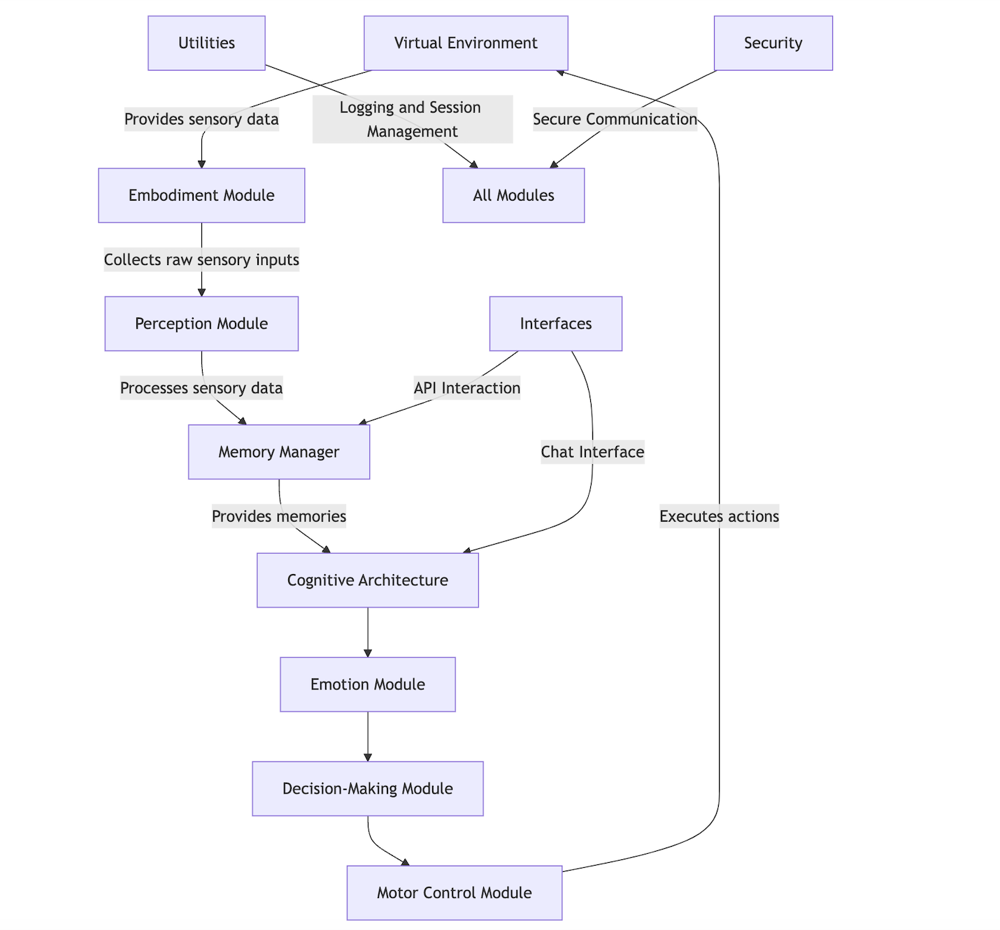

# Human Consciousness Simulation

## Table of Contents

- [Introduction](#introduction)
- [Features](#features)
- [Architecture](#architecture)
- [Installation](#installation)
- [Usage](#usage)
- [Documentation](#documentation)
- [Testing](#testing)
- [Contributing](#contributing)
- [License](#license)
- [Contact](#contact)
- [Acknowledgments](#acknowledgments)

---

## Introduction

The **Human Consciousness Simulation** is an advanced project designed to authentically replicate human cognitive processes. By integrating various modules such as perception, memory, cognitive architecture, emotion modeling, and more, this simulation aims to provide insights into the complexities of human consciousness. The system is built with scalability and security in mind, leveraging distributed computing and Zero Trust Network Access (ZTNA) principles to ensure robust performance across multiple GPUs and nodes.

---

## Features

- **Modular Architecture**: Easily extensible modules covering various aspects of consciousness.
- **Multisensory Integration**: Processes and integrates data from multiple sensory modalities.
- **Cognitive Architecture**: Implements the ACT-R cognitive model for reasoning and decision-making.
- **Emotion Modeling**: Simulates emotional states and their influence on cognition.
- **Memory Management**: Handles sensory, short-term, and long-term memories with decay mechanisms.
- **Distributed Computing**: Scalable across multiple GPUs and nodes using PyTorch's Distributed Data Parallel (DDP).
- **Secure Communication**: Implements Zero Trust Network Access (ZTNA) for secure data transmission.
- **API Interfaces**: Provides APIs for memory interaction and chat-based user interactions.
- **Extensive Documentation**: Comprehensive guides and references for developers and users.
- **Testing Suite**: Robust unit and integration tests to ensure reliability.

---

## Architecture

The simulation's architecture is highly modular and designed for scalability and maintainability. Key components include:

- **Virtual Environment**: Simulates the external world, providing sensory data and receiving motor actions.
- **Embodiment Module**: Interfaces with the virtual environment to collect sensory inputs and execute actions.
- **Perception Module**: Processes raw sensory data, creates sensory memories, and integrates information across modalities.
- **Memory Manager**: Manages all types of memories, including storage, retrieval, and decay of sensory memories.
- **Cognitive Architecture**: Implements cognitive processes such as reasoning, problem-solving, and learning based on the ACT-R model.
- **Emotion Module**: Simulates emotional states and their influence on cognition.
- **Decision-Making Module**: Facilitates action selection based on cognitive and emotional inputs.
- **Motor Control Module**: Executes actions within the virtual environment, creating a feedback loop.
- **Interfaces**: Provides APIs and chat-based interfaces for user interaction and external data access.
- **Utilities**: Includes helper functions, logging, and session management.
- **Security**: Ensures secure communication and data handling through ZTNA principles.

For a detailed overview, refer to the [Architecture Documentation](docs/architecture.md).

---

## Installation

### Prerequisites

- **Python 3.8+**
- **PyTorch 1.8+**
- **CUDA 10.2+** (if using GPU acceleration)
- **Git**

### Steps

1. **Clone the Repository**

	git clone https://github.com/yourusername/human-consciousness-simulation.git
	cd human-consciousness-simulation

2. **Create a Virtual Environment**

	python -m venv venv
	source venv/bin/activate  # On Windows: venv\Scripts\activate

3. **Install Dependencies**

	pip install -r requirements.txt

4. **Configure the Simulation**

- Copy the sample configuration file and modify as needed.

	cp config/config.sample.yaml config/config.yaml

- Edit `config/config.yaml` to set your desired parameters.

5. **Download Sample Data**

	python scripts/download_data.py

---

## Usage

### Running the Simulation Locally

	python src/main.py

### Running the Simulation in a Distributed Environment

Ensure that you have multiple GPUs or nodes set up for distributed computing.

	python scripts/run_distributed_simulation.py

### Interacting via Chat Interface

Start the web server to interact with the simulation through a web-based chat interface.

	python web/app.py

Navigate to `http://localhost:8000/chat` in your web browser.

---

## Documentation

Comprehensive documentation is available in the `docs/` directory. Key documents include:

- [Architecture Overview](docs/architecture.md)
- [API Reference](docs/api_reference.md)
- [User Guide](docs/user_guide.md)
- [Sensory Integration](docs/sensory_integration.md)
- [Data Integration](docs/data_integration.md)
- [Distributed Computing](docs/distributed_computing.md)
- [Security and ZTNA](docs/security_and_ztna.md)
- [Design Decisions](docs/DESIGN_DECISIONS.md)
- [Turing Test Plan](docs/turing_test_plan.md)
- [Additional Resources](docs/additional_resources.md)

---

## Testing

The project includes a comprehensive testing suite to ensure functionality and reliability.

### Running Unit Tests

	python -m unittest discover tests

### Running Specific Tests

	python -m unittest tests.test_memory

### Test Coverage

To check test coverage, you can use tools like `coverage.py`:

1. **Install Coverage**

	
	pip install coverage

2. **Run Coverage**

	coverage run -m unittest discover tests
	coverage report -m

---

## Contributing

Contributions are welcome! Please follow the guidelines below to contribute to the project.

### Steps to Contribute

1. **Fork the Repository**

2. **Create a Feature Branch**

	git checkout -b feature/YourFeature

3. **Commit Your Changes**

	git commit -m "Add Your Feature"

4. **Push to Your Fork**

	git push origin feature/YourFeature

5. **Open a Pull Request**

- Ensure that your PR adheres to the [Code of Conduct](CODE_OF_CONDUCT.md) and follows the [Contributing Guidelines](CONTRIBUTING.md).

### Guidelines

- Write clear and concise commit messages.
- Ensure that your code follows the project's coding standards.
- Include tests for new features or bug fixes.
- Update documentation as necessary.

For detailed guidelines, refer to [CONTRIBUTING.md](CONTRIBUTING.md).

---

## License

This project is licensed under the [MIT License](LICENSE).

---

## Contact

For any inquiries or support, please contact:

- **Project Lead**: John Speranza
- **Email**: john@c3aero.com
- **GitHub**: [@c3aero](https://github.com/c3aero)

---

## Acknowledgments

- **OpenAI** for their foundational research and models.
- **PyTorch Community** for providing powerful tools for machine learning.
- **All Contributors** who have helped in building and refining this simulation.

---

**Note**: This project is under active development. Please refer to the [Roadmap](ROADMAP.md) for upcoming features and updates.
